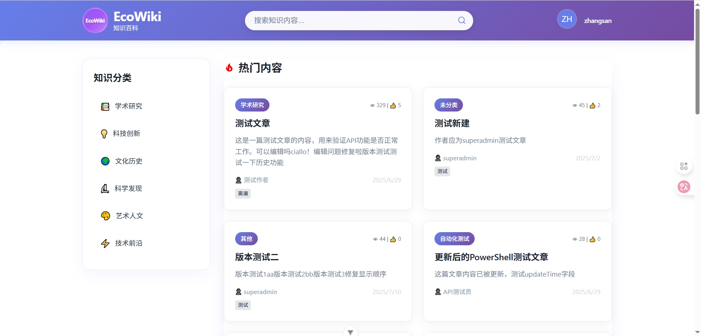
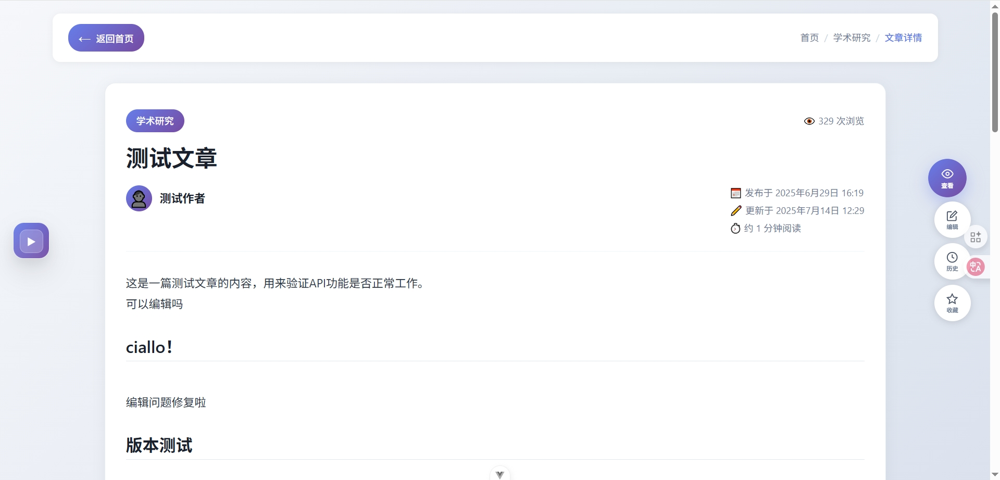
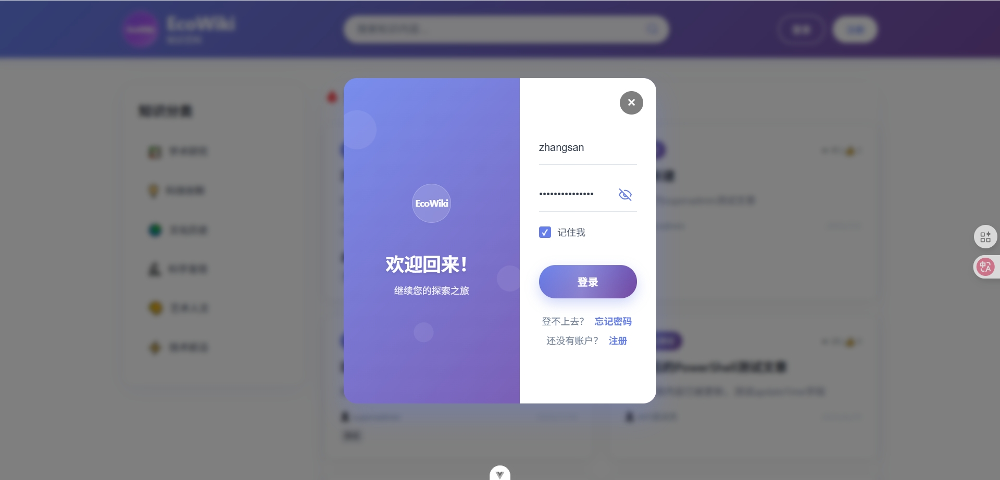
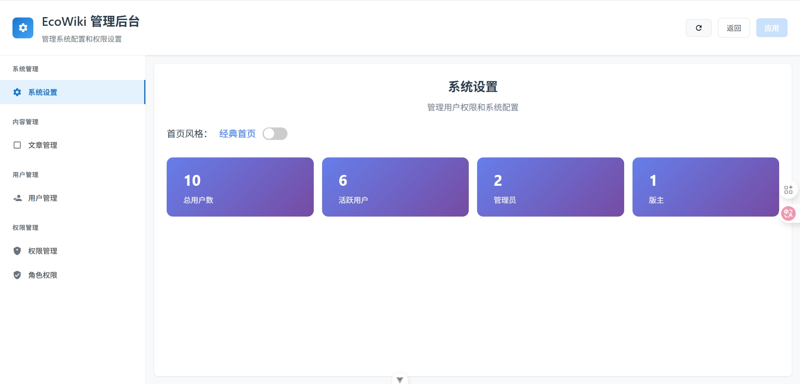

## 技术栈
- 前端：Vue
- 后端：Springboot
- 数据库：mysql
- 状态管理：pinia
- 版本管理：git
## 前言
在日常一些基于兴趣爱好导致的偶然中，我们发现常见知名度较高的wiki框架都有各种各样的限制，比如功能过于复杂，不够轻量化，不够灵活，不够安全，不够易用，不够开放，不够可靠，不够可扩展等等。

因此，我们萌生了开发一款基于兴趣爱好和对wiki的热爱，希望能开发出一款简约、高性能、易用、可扩展、安全、可靠的wiki框架。
## demo展示

## 目标
- 简约：框架的核心功能只提供最基本的wiki功能，其他功能都以插件的形式存在，可自由选择安装，降低框架的复杂度。
- 高性能：框架采用主流的技术栈，采用分层架构，保证框架的高性能，并提供性能优化的方案。
- 易用：框架提供丰富的接口和api，使得使用者可以快速上手，并提供丰富的文档和示例。
- 可扩展：框架提供插件机制，使得其他开发者可以基于框架的接口和api开发出新的功能插件，并提供插件市场，方便用户查找和安装。
- 安全：框架采用安全的技术栈，并提供安全防护的方案，保证框架的安全性。
- 可靠：框架提供丰富的测试用例，并提供持续集成的方案，保证框架的可靠性。
- 可扩展：框架提供插件机制，使得其他开发者可以基于框架的接口和api开发出新的功能插件，并提供插件市场，方便用户查找和安装。

## 介绍
这款框架有着属于自己的绿色生态圈，核心强大而精简，只提供高性能的基本功能，其他所有功能都将以插件的形式的存在，我们会开放很多各种各样的接口，其他人可以基于这些接口和api进行定制开发或者为ecowiki的生态开发出新的功能插件。

框架安装时，只提供必要的刚需功能，其他插件是否安装均取决于使用者本身，且所有大功能都以模块的形式出现，可在需要时解耦且不影响框架的正常运行。

目前处于开发初期，团队为3人，如有有志之士，欢迎你的加入

github：https://github.com/yahayao/EcoWiki
blog：https://www.edaylogy.com/1750395139677

成员-排名不分先后：Alng、啊啊、倾仙

VUE+mysql+springboot

本页面会随着开发进度持续更新，由于非商业框架，都有自己的工作和生活，所以开发进度会比较随机。
