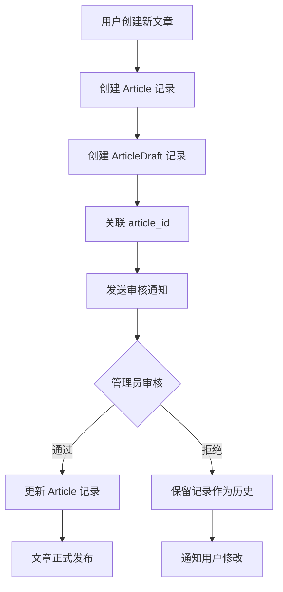

# 文章草稿审核系统快速入门指南

## 🚀 5分钟快速开始

### 第一步：环境准备

1. **确保数据库已初始化**

   ```bash
   mysql -u root -p ecowiki < ARTICLE_REVIEW_SYSTEM_INIT.sql
   ```

2. **启动后端服务**

   ```bash
   cd www/backend
   mvn spring-boot:run
   ```

3. **启动前端服务**

   ```bash
   cd www/frontend
   npm run dev
   ```

### 第二步：基础配置

1. **设置管理员权限**
   - 登录超级管理员账号 (superadmin)
   - 进入用户管理 → 角色权限
   - 确保管理员用户有审核权限

2. **用户角色权限**
   - 普通用户：可以创建/编辑文章草稿
   - 管理员：可以审核草稿

### 第三步：创建第一篇文章（新流程）

1. **用户创建新文章**
   - 访问: `http://localhost:3000/create`
   - 填写文章标题、内容、分类等信息
   - 点击"创建页面"按钮

2. **系统处理流程**
   - 自动创建 Article 记录（分配 article_id）
   - 创建对应的 ArticleDraft 记录
   - 关联 Article 和 Draft (draft.article_id = article.article_id)
   - 发送审核通知给管理员

3. **草稿状态**
   - 状态：PENDING（待审核）
   - 用户看到："页面已提交审核，请等待管理员审核！"

### 第四步：管理员审核草稿

1. **进入草稿审核界面**
   - 访问管理后台: `http://localhost:3000/admin/drafts`
   - 查看待审核草稿列表

2. **审核操作**
   - 点击草稿查看详细内容
   - 选择"通过"或"拒绝"
   - 填写审核备注（可选）
   - 提交审核结果

3. **审核结果处理**
   - **通过**：更新对应的 Article 记录，文章正式发布
   - **拒绝**：保留草稿和文章记录作为历史

## 🎯 核心功能演示

### 创建新文章草稿示例

```typescript
// 前端调用示例 (CreatePage.vue)
const createPage = async () => {
  try {
    const articleData = {
      title: form.value.title.trim(),
      content: '',  // 空白页面
      category: '未分类',
      tags: '',
      author: user.value?.username || '当前用户'
    };
    
    // 调用提交新文章草稿API
    const response = await draftApi.submitNewArticle(articleData);
    
    toast.success('页面已提交审核，请等待管理员审核！', '成功');
    router.push('/');
    
  } catch (error) {
    console.error('创建页面失败:', error);
    toast.error(error.message || '创建页面失败', '错误');
  }
};
```

### 审核草稿示例

```typescript
// 管理员审核示例 (DraftReviewDashboard.vue)
const reviewDraft = async (draft: ArticleDraft, approved: boolean, notes: string) => {
  try {
    const reviewData = {
      approved: approved,
      reviewNotes: notes
    };
    
    const response = await draftApi.reviewDraft(draft.draftId, reviewData);
    
    if (approved) {
      toast.success('草稿审核通过，文章已发布！', '审核成功');
    } else {
      toast.success('草稿已拒绝，已发送通知给作者', '审核完成');
    }
    
    // 更新缓存和列表
    updateCacheAfterReview(draft, approved);
    
  } catch (error) {
    console.error('审核失败:', error);
    toast.error(error.message || '审核操作失败', '错误');
  }
};
```

## 🔧 常用操作

### 1. 查看草稿统计

```typescript
// 获取草稿统计数据 (在DraftReviewDashboard中)
const stats = computed(() => {
  const pending = allDrafts.value.filter(d => d.reviewStatus === 'PENDING').length
  const approved = allDrafts.value.filter(d => d.reviewStatus === 'APPROVED').length
  const rejected = allDrafts.value.filter(d => d.reviewStatus === 'REJECTED').length
  return { pending, approved, rejected }
})
```

## ⚠️ 重要变更说明（2025-08-05 更新）

### 架构变更
1. **统一的文章创建流程**：新建文章和编辑文章现在都遵循相同的审核流程
2. **article_id 必须有值**：所有草稿记录都必须关联到一个 article 记录
3. **历史记录保留**：审核拒绝时不再删除任何记录，保留完整历史

### 数据流变更


### API 变更
- `POST /api/drafts/submit-new`：现在会先创建 Article 记录
- 审核通过：更新现有 Article 而不是创建新的
- 审核拒绝：保留所有记录，不删除任何数据

---

## 🔧 常用操作

### 1. 查看草稿统计

```typescript
// 获取草稿统计数据 (在DraftReviewDashboard中)
const stats = computed(() => {
  const pending = allDrafts.value.filter(d => d.reviewStatus === 'PENDING').length
  const approved = allDrafts.value.filter(d => d.reviewStatus === 'APPROVED').length
  const rejected = allDrafts.value.filter(d => d.reviewStatus === 'REJECTED').length
  return { pending, approved, rejected }
})
```

### 2. 按状态筛选草稿

```typescript
// 筛选草稿
const filterByStatus = (status: 'ALL' | 'PENDING' | 'APPROVED' | 'REJECTED') => {
  selectedStatus.value = status
  applyCurrentFilter()
}
```

### 3. 批量操作（未来功能）

```typescript
// 批量审核（计划功能）
const batchReview = async (draftIds: number[], approved: boolean) => {
  // 实现批量审核逻辑
}
```

### 4. 搜索审核记录

```typescript
// 搜索草稿记录
const searchDrafts = async (keyword: string) => {
  // 实现关键词搜索逻辑
    page: params.page,
    size: params.size
  });
  return response.data;
};
```

### 3. 批量处理审核

```javascript
// 批量处理审核
const batchProcess = async (reviewIds, action) => {
  const response = await reviewApi.batchProcess(
    reviewIds, 
    action, 
    '批量处理'
  );
  return response.data;
};
```

## 📱 界面截图说明

### 审核管理主界面

- **统计面板**: 显示总审核数、待审核数、通过率等
- **筛选器**: 按状态、类型、时间范围筛选
- **审核列表**: 显示所有审核记录的详细信息
- **操作按钮**: 创建、分配、处理、查看详情

### 创建审核对话框

- **文章ID输入**: 数字输入框，支持验证
- **审核类型选择**: 下拉选择CREATE/UPDATE/DELETE
- **内容快照**: 多行文本输入，可选填写
- **自动发布开关**: 勾选后审核通过自动发布文章

### 审核处理界面

- **审核详情**: 显示文章信息、提交者、审核类型
- **审核操作**: 通过/拒绝单选按钮
- **审核意见**: 必填的文本区域
- **历史记录**: 显示该审核的所有操作历史

## ⚠️ 注意事项

### 权限要求

- **创建审核**: 需要 `review.create` 权限
- **处理审核**: 需要 `review.process` 权限
- **管理审核**: 需要 `review.manage` 权限

### 数据约束

- 文章ID必须存在且大于0
- 审核类型必须是有效枚举值
- 内容快照长度不超过1000字符

### 业务规则

- 每篇文章在同一状态下只能有一个待审核记录
- 审核员不能审核自己提交的文章
- 超级管理员可以审核所有文章

## 🐛 故障排除

### 常见错误及解决方案

1. **"找不到文章ID"**
   - 检查文章ID是否正确
   - 确认文章是否存在于数据库中

2. **"权限不足"**
   - 检查用户角色权限配置
   - 确认用户已登录且session有效

3. **"审核员分配失败"**
   - 检查是否有可用的审核员
   - 确认审核员权限配置正确

4. **"消息发送失败"**
   - 检查消息服务是否正常运行
   - 确认目标用户ID有效

### 日志查看

```bash
# 查看审核服务日志
tail -f logs/review-service.log

# 查看错误日志
grep "ERROR" logs/application.log

# 查看API调用日志
grep "review" logs/access.log
```

## 📞 获取帮助

- **在线文档**: 查看完整的《文章审核系统使用文档.md》
- **API文档**: 访问 `/api/docs` 查看详细的API接口文档
- **问题反馈**: 通过GitHub Issues报告问题
- **技术支持**: 联系开发团队获取技术支持

---

**提示**: 本指南涵盖了基础使用方法，更多高级功能请参考完整文档。
